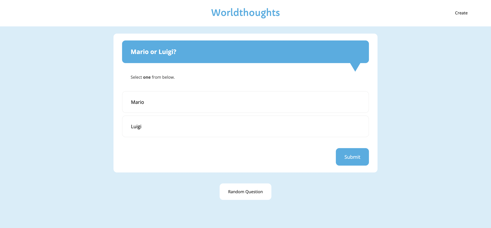
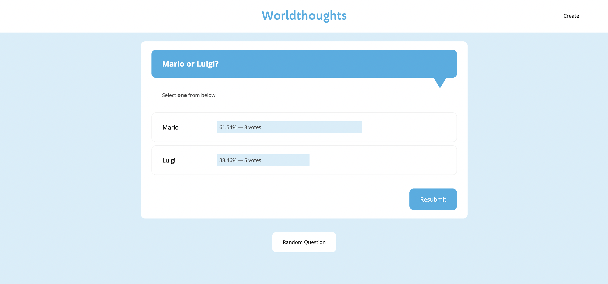
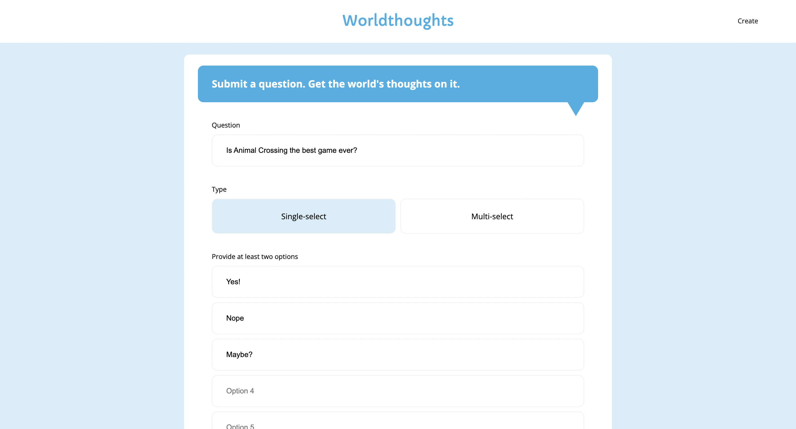

# 🌐 Worldthoughts

A simple and friendly real-time polling application.

- Users can discover random polls by pressing the "random question" button and vote on each.
- Afterwards, results will be displayed to the user and update in real-time.
- Pressing the "resubmit" button will allow the user to change their vote.
- Users can go to the *create* page and submit their own questions to the site.

[Check out the **API** for Worldthoughts here!](https://github.com/melaniietong/worldthoughts-api)

## Dependencies
- React
- React-router / react-router-dom
- Socket.io-client
- Universal-cookie

## Setup

```diff
!  ⚠️ Please setup the API first before this client ⚠️
``` 

1. Install Node.js and npm.
2. Download the project.
3. In your terminal in the project directory, enter the command `npm install`.
4. To run the app, enter the command `npm start`.
5. The app will run on localhost:3000.

## Preview


> Explore random polls.


> Vote on polls and discover what the world thinks about it.


> Submit your own questions.